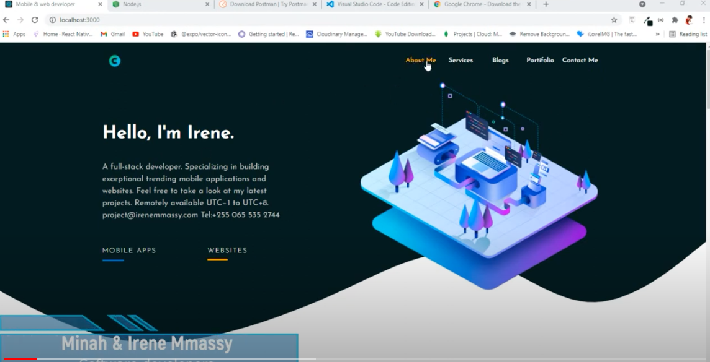

Session :1
Mern Stack Project #01 | Build a Portfolio Website & Deploy | Project Preview

https://www.youtube.com/watch?v=VOB5JncJnRc&list=PLE_Uj9ql8q9_8j-pl3_VnT09rMu0MlPK1&index=1

Tools we use
1. NodeJS
2. Postman
3. VSCode
4.Chrome Browser - with DevTools

Session 2:
https://www.youtube.com/watch?v=NNT7OqiOXms&list=PLE_Uj9ql8q9_8j-pl3_VnT09rMu0MlPK1&index=2

Install and Setup React & React Bootstrap #02 | Portfolio Site With Node JS , Express and React

npx create-react-app front-end
cd front-end

Then move inside to front-end folder
and install React BootStap.

npm install react-bootstrap bootstrap
